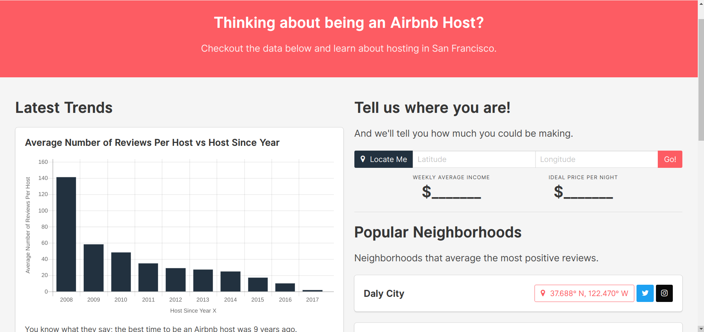

# CapitalOne Challenge (for Winter Summit 2018)
#### built by [Omkar Konaraddi](https://konaraddio.github.io/)

This was a winning submission. ~450 applied for the summit. 40 were accepted.

Challenge: https://www.mindsumo.com/contests/airbnb-sf

Submission: https://konaraddio.github.io/c1-airbnb



# Table of Contents
* [Built with...](#built-with)
* [Objectives](#objectives)
    * [Main Objectives](#main-objectives)
    * [Bonus Objectives](#bonus-objectives)
* [How Objectives Were Completed](#how-objectives-were-completed)
* [FAQs](#faqs)
* [Getting Started](#getting-started)

# Built With...
* HTML, CSS, Sass, JavaScript, Python
* [Bulma 0.6.0](https://bulma.io/) for making things look presentable
* [PapaParse 4.3.6](http://papaparse.com/) for CSV data processing
* [Chartjs 2.4.0](http://www.chartjs.org/) for data visualization
* [Vuejs](https://vuejs.org/) for keeping things DRY

# Objectives 

### Main Objectives
- **Visualize the data**: Graph some (any 3) interesting metrics, maps, or trends from the dataset.
- **Price estimation**: Given the geo-location (latitude and longitude) of a new property, estimate the weekly average income the homeowner can make with Airbnb.
- **Bookings optimization**: Given the geo-location (latitude and longitude) of a property, what is the ideal price per night that will yield maximum bookings.

### Bonus Objectives
- **Animate**: Add an animation to your visualization.
- **Investment**: If I have $100 million to invest, where in San Francisco should I buy properties so I can maximize my returns with Airbnb? When will I break even?
- **Popularity**: Can you identify the neighborhood that averages the most positive reviews?

# How objectives were completed

### **Visualize the data**: Graph some (any 3) interesting metrics, maps, or trends from the dataset.
Created 3 graphs with Chartjs:
* **Average Number of Reviews Per Host vs Year Since Host**
    * The longer a host has been a host, the more reviews they tend to have.
* **Review Score Rating vs Square Feet**
    * Bigger places doesn't necessarily mean better ratings
* **Average Price per Night vs Bedrooms**
    * On average, the more bedrooms there are, the higher the price. If you got a lot of bedrooms, it may be best to keep the price relatively high.

### **Price estimation**: Given the geo-location (latitude and longitude) of a new property, estimate the weekly average income the homeowner can make with Airbnb.
Look for places that are within 0.01 of the user's property's latitude and longitude, then took the average of the places' prices. Multiply by 7 to get estimated weekly income.

### **Bookings optimization**: Given the geo-location (latitude and longitude) of a property, what is the ideal price per night that will yield maximum bookings.
Look for places that are within 0.01 degrees of the user's property's latitude and longitude, then took the average of the places' prices.

### **Animate**: Add an animation to your visualization.
* Loading screen
* Notification that fades in and out at the bottom of the screen when there's an error related to the location service
* Hovering on a data point on each graph reveals a tooltip detailing the data.

### **Investment**: If I have $100 million to invest, where in San Francisco should I buy properties so I can maximize my returns with Airbnb? When will I break even?
Went through all properties and assigned a score to each. The score was calculated as follows: 
``` json
number_of_reviews * rating * price / (purchasing_cost)
```
The purpose of this score was to quantify the popularity, price, and cost to purchase of a given property in 1 comparable quantity. High scores indicate properties worth buying. The properites were ordered from the highest to lowest scores. 

Using the set of best properties, only the first properties whose prices summed together are less than $100 million are displayed. Note that only a few properties are initially displayed and the user can click to see more.

### **Popularity**: Can you identify the neighborhood that averages the most positive reviews?
Identified the top neighborhoods by calculating the average review rating for each neighborhood.

# FAQs

#### What font are you using?

[Inter UI](https://rsms.me/inter/), you should check it out!

#### Why is your "Getting Started" below the "FAQs"?

I don't expect many people to use this project in their own projects. It's really there for me to know what's up if I come back to this project. So it's low priority for those just checking out the project.

# Getting Started

* Clone the repository: `git clone https://github.com/konaraddio/c1-airbnb.git`
* Whip up a test server in the directory (e.g. install http-server from npm and run `http-server .`)